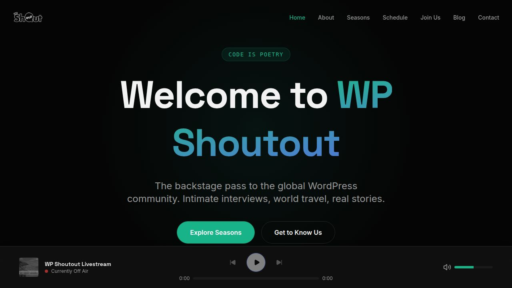

# WP Shoutout

> The backstage pass to the global WordPress community — intimate interviews, world travel, real stories, broadcast live from WordCamps around the world.

[](https://github.com/vineettalwar/wpshoutout-website/actions/workflows/ci-cd.yml)

**Live site:** [wpshoutout.com](https://wpshoutout.com)

---

## Overview

WP Shoutout is a premium WordPress podcast website. It consists of:

- A **React + Vite static frontend** (7 pages: Home, About, Seasons, Schedule, Join Us, Blog, Contact) with a persistent audio player powered by Spotify embeds.
- An **Express 5 API server** that handles the contact form and sends emails via Resend.
- 9 seasons of WordCamp interviews across Europe, Asia, and Latin America, totalling 30+ episodes.

The design is dark, premium, and inspired by Apple Music and Spotify — built with Tailwind CSS v4 and Framer Motion animations.

---

## Screenshots



---

## Stack

| Layer | Technology |
|---|---|
| Monorepo | pnpm workspaces |
| Node.js | v24 |
| Frontend | React 19 + Vite 7 + Tailwind CSS v4 |
| Routing | Wouter |
| Animations | Framer Motion |
| API | Express 5 |
| Database | PostgreSQL + Drizzle ORM |
| Validation | Zod (zod/v4), drizzle-zod |
| Email | Resend |
| Audio | Spotify embeds |
| CI/CD | GitHub Actions → GitHub Pages + deploy hook |

---

## Project Structure

```
.
├── artifacts/
│   ├── wpshoutout/         # React + Vite frontend (static site)
│   │   ├── public/         # Static assets (favicon.svg, opengraph.jpg)
│   │   ├── src/
│   │   │   ├── pages/      # Home, About, Seasons, Season, Schedule, JoinUs, Blog, BlogPost, Contact
│   │   │   ├── components/ # NavBar, AudioPlayer, EpisodeRow, Layout, PageTransition, ui/
│   │   │   ├── data/       # episodes.ts, seasons.ts, blog.ts (static content)
│   │   │   ├── context/    # Audio player context
│   │   │   ├── hooks/      # Custom hooks (useToast, useIsMobile)
│   │   │   └── lib/        # seo.ts, utils.ts
│   │   └── vite.config.ts
│   └── api-server/         # Express 5 API server
│       └── src/
│           ├── routes/     # contact.ts, health.ts
│           ├── middlewares/
│           └── lib/        # logger.ts
├── lib/
│   ├── db/                 # Drizzle ORM schema + migrations
│   │   ├── migrations/     # Versioned SQL migration files (checked in)
│   │   ├── src/
│   │   │   ├── schema/     # Drizzle table definitions
│   │   │   └── migrate.ts  # Migration runner
│   │   └── drizzle.config.ts
│   ├── api-spec/           # OpenAPI spec (source of truth for API shape)
│   ├── api-zod/            # Zod schemas generated from API spec
│   └── api-client-react/   # React Query API client generated from spec
├── scripts/
│   └── post-merge.sh       # Runs after every merge: install + migrate
├── .github/workflows/
│   └── ci-cd.yml           # CI: typecheck + build; CD: GitHub Pages + API deploy hook
├── docs/
│   └── admin.md            # Admin guide: adding episodes, managing keys, migrations
├── design.md               # Design system: typography, colors, layout, components
├── roadmap.md              # Shipped features, in-progress, and future ideas
└── memory.md               # Decisions log for future agents and contributors
```

---

## Local Setup

### Prerequisites

- **Node.js 24** — install via [nvm](https://github.com/nvm-sh/nvm): `nvm install 24 && nvm use 24`
- **pnpm 10** — `npm install -g pnpm@10`
- **PostgreSQL** (optional; only needed if you want to run DB migrations locally)

### 1. Clone and install

```bash
git clone https://github.com/vineettalwar/wpshoutout-website.git
cd wpshoutout
pnpm install
```

### 2. Environment variables

Copy the example and fill in your values:

```bash
cp .env.example .env
```

| Variable | Required for | Default |
|---|---|---|
| `RESEND_API_KEY` | Contact form emails | — (must be set) |
| `DATABASE_URL` | DB migrations | — (must be set if running migrate) |
| `CONTACT_EMAIL` | Contact form recipient | `hello@wpshoutout.com` |
| `CONTACT_FROM_EMAIL` | Contact form sender | `noreply@wpshoutout.com` |
| `PORT` | API server port | must be set |
| `BASE_PATH` | Frontend base path | must be set |

### 3. Run the frontend

```bash
# In one terminal
BASE_PATH=/ PORT=5173 pnpm --filter @workspace/wpshoutout run dev
```

The frontend is now at **http://localhost:5173**.

### 4. Run the API server

```bash
# In another terminal
PORT=3001 RESEND_API_KEY=re_... pnpm --filter @workspace/api-server run dev
```

The API server is now at **http://localhost:3001**.

The contact form at `http://localhost:5173/contact` will POST to the relative path `/api/contact` by default. To point it at the local API server, set `VITE_API_BASE_URL=http://localhost:3001` when running the frontend.

### 5. Typecheck

```bash
pnpm run typecheck
```

---

## Scripts

| Command | Description |
|---|---|
| `pnpm install` | Install all workspace dependencies |
| `pnpm run typecheck` | Type-check all packages |
| `pnpm --filter @workspace/wpshoutout run dev` | Start frontend dev server |
| `pnpm --filter @workspace/api-server run dev` | Start API dev server |
| `pnpm --filter @workspace/wpshoutout run build` | Build frontend for production |
| `pnpm --filter @workspace/api-server run build` | Build API server for production |
| `pnpm --filter @workspace/db run generate` | Generate SQL migrations from schema changes |
| `pnpm --filter @workspace/db run migrate` | Apply pending migrations to `DATABASE_URL` |
| `pnpm --filter @workspace/db run push` | **Dev only** — push schema directly to DB (no migration files) |

---

## Database Migrations

Schema changes follow a generate → review → commit → apply workflow:

```bash
# 1. Edit lib/db/src/schema/index.ts (add or modify tables)
# 2. Generate the SQL migration
pnpm --filter @workspace/db run generate
# 3. Review the generated file in lib/db/migrations/
# 4. Commit the migration file with your schema changes
git add lib/db/migrations/
git commit -m "feat: add posts table"
# 5. Apply to the target database
DATABASE_URL=postgres://... pnpm --filter @workspace/db run migrate
```

> `db:push` is **dev-only**. It introspects the live database and applies schema changes without generating migration files. Never use it in CI or production — it can silently drop data on schema conflicts.

---

## Environment Variables (full reference)

### Local development / Replit

| Variable | Description |
|---|---|
| `RESEND_API_KEY` | Resend API key for contact form emails |
| `DATABASE_URL` | PostgreSQL connection string |
| `CONTACT_EMAIL` | Email address that receives contact form submissions |
| `CONTACT_FROM_EMAIL` | Sender address shown on contact emails |
| `PORT` | Port for the frontend or API server process |
| `BASE_PATH` | Base path for the Vite frontend (use `/` locally) |

### GitHub Actions secrets & variables

| Name | Type | Description |
|---|---|---|
| `API_BASE_URL` | Secret | Full URL of the deployed API server, e.g. `https://api.wpshoutout.com` |
| `API_DEPLOY_HOOK` | Secret | Deploy hook URL from Render/Railway to redeploy the API on push |
| `PAGES_BASE_PATH` | Variable | Override GitHub Pages base path (default `/<repo-name>/`; set to `/` for custom domain) |

---

## Deployment

### Frontend → GitHub Pages

The frontend is deployed automatically to GitHub Pages on every push to `main` via the CI/CD workflow (`.github/workflows/ci-cd.yml`).

**One-time setup:**
1. Go to **Settings → Pages → Source** and select **GitHub Actions**
2. Add the `API_BASE_URL` secret
3. Add the `API_DEPLOY_HOOK` secret (from Render/Railway)
4. Push to `main`

### API Server → Render / Railway

The API server can be deployed to any platform that supports Node.js and provides a deploy hook URL. See [docs/admin.md](docs/admin.md) for step-by-step Render instructions.

**Required environment variables on the hosting platform:**
- `PORT` — set by the platform
- `DATABASE_URL` — connection string for your production PostgreSQL
- `RESEND_API_KEY` — your Resend API key

---

## Audio Policy

Podcast audio plays via **Spotify embeds** (remote). No audio files are stored in the repository. Episode metadata and Spotify track IDs live in `artifacts/wpshoutout/src/data/episodes.ts`.

If a local audio file ever needs to be added (e.g. a one-off promo clip), files **under 10 MB** can be committed to `artifacts/wpshoutout/public/audio/`. For larger files, document the remote URL in `memory.md` and load it via a `<source>` tag.

## Image Policy

All images are committed inside the repository — no external hot-links:

| Type | Location |
|---|---|
| Season cover art | `artifacts/wpshoutout/public/images/seasons/` |
| Blog post thumbnails | `artifacts/wpshoutout/public/images/blog/` |
| About page gallery | `artifacts/wpshoutout/public/images/about/` |
| Favicon, OG image | `artifacts/wpshoutout/public/` |

When adding a new season or blog post, commit the image to the appropriate folder and reference it as `/images/seasons/...` or `/images/blog/...`. See [docs/admin.md](docs/admin.md) for step-by-step instructions.

---

## Documentation

| File | Description |
|---|---|
| [design.md](design.md) | Design system: typography, colors, layout, components |
| [roadmap.md](roadmap.md) | Shipped features, in-progress, and future ideas |
| [replit.md](replit.md) | Replit-specific architecture, workflows, secrets, and deploy notes |
| [memory.md](memory.md) | Decision log: why Spotify embeds, why path-based routing, CI/CD notes |
| [docs/admin.md](docs/admin.md) | Admin guide: adding episodes, managing keys, running migrations |

---

## Contributing

1. Fork the repository and create a branch from `main`
2. `pnpm install` to install dependencies
3. Make your changes and run `pnpm run typecheck` to verify
4. Open a pull request — CI will typecheck and build automatically

---

## License

MIT
